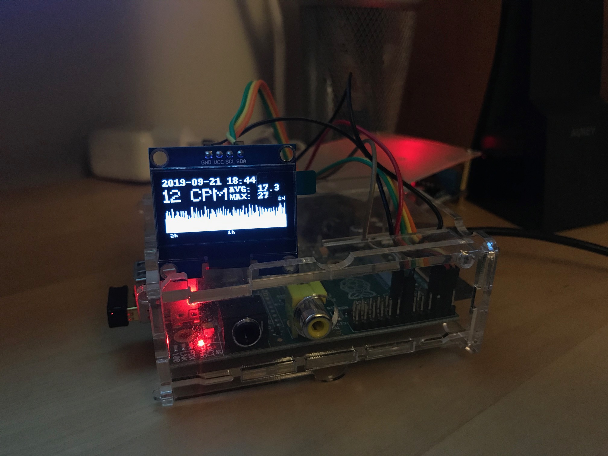

# RaspberryGeigerCounter

A small code to use cheap Geiger counter board (RadiationD CAJOE) with a raspberry.

First, to use with GPIO ports, you need to change R19 from 47kOhms to 1kOhms.

The code counts the ticks every minute and displays the results on a 1.3 OLED screeen using SH1106 driver.

